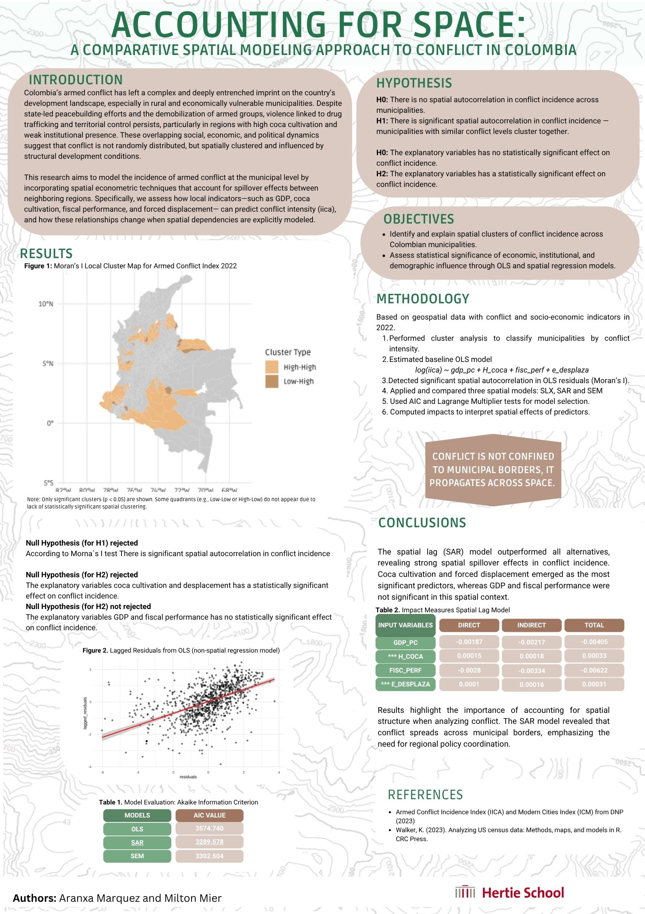

# Spatial Modeling of Armed Conflict in Colombia (2022)

## 📍 Project Overview

This project investigates the spatial dynamics of armed conflict in Colombia by modeling municipal-level conflict intensity using spatial econometric techniques. Drawing on 2022 geospatial data and socio-economic indicators—such as GDP per capita, coca cultivation, fiscal performance, and forced displacement—the analysis reveals that conflict is not randomly distributed but spatially clustered, reflecting deeper structural conditions. By applying models that account for spatial spillover effects (SLX, SAR, and SEM), the project demonstrates that local development factors influence not only a municipality’s exposure to violence but also that of its neighbors. The findings provide insights into how geographically-informed policies could better address the persistence of violence in post-conflict settings.

---

  

------------------------------------------------------------------------

**Authors:**\
[Milton Mier Santander](https://github.com/Milton0215) \| [Aranxa Márquez Ampudia](https://github.com/aranxaMarAm) 

**Last updated:** 2025-05-15

This analysis was made as part of the course **GRAD-E1457 - Geospatial Analysis for Data Science**, taught by Prof. [Alexandra Kapp](https://scholar.google.de/citations?user=Uq5J4p8AAAAJ) in the [Hertie School Master of Data Science for Public Policy](https://www.hertie-school.org/en/mds) Program

------------------------------------------------------------------------

## Contribution Statement

All authors contributed equally in the research design and coding.

------------------------------------------------------------------------

## Acknowledgments

-   **[DNP](https://www.dnp.gov.co/Prensa_/Noticias/Paginas/conozca-las-ciudades-departamentos-y-municipios-mas-modernos-del-pais-de-acuerdo-con-indice-del-dnp.aspx)** (Departamento de Planeación de Colombia) for the data.
------------------------------------------------------------------------

Questions or ideas? Open an issue!

